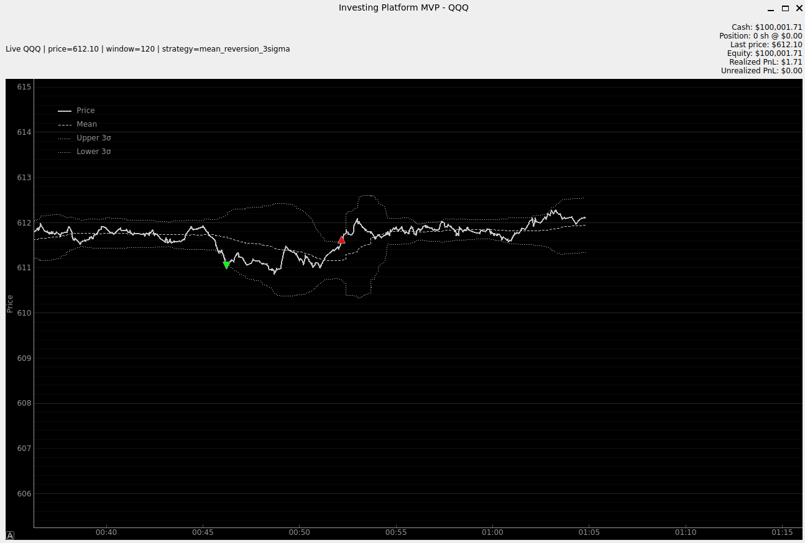

# (Rudimental) Trading Platform

A Python-based low-latency market monitoring and paper-trading platform for live stock data, visualization, and strategy research

This project currently focuses on:
- live market data
- real-time plotting
- paper trade tracking for strategy evaluation
- modular strategy design for future experimentation

Current strategy: **mean reversion strategy** with **3-sigma entry thresholds** 

---

## Overview

This platform is designed for monitoring live market data (single symbol) and testing trading logic in real time
At this stage, it is a research and paper-trading tool

The current workflow is:
1. Load recent historical data to warm up the strategy state (1 min)
2. Connect to live WebSocket market data stream
3. Update chart
4. Run trading strategy on incoming prices
5. Generate buy/sell signals
6. Track the resulting paper transactions and portfolio state

---

## Architecture
### Main Components

#### 1. Market Data Layer
Responsible for:
- loading historical bars for initialization
- connecting to live market data through WebSocket
- normalizing incoming data into a consistent internal format

#### 2. Strategy Layer
Responsible for:
- maintaining rolling statistics
- evaluating the current signal condition
- deciding when a buy or sell signal should be generated

New strategies can be introduced later without redesigning the whole platform as a swappable block

#### 3. Position Sizing Layer
Responsible for:
- determining how much capital should be allocated to a signal
- converting a signal into a paper-trade quantity

#### 4. Paper Portfolio Layer
Responsible for:
- tracking cash
- tracking current position
- updating average cost
- calculating realized and unrealized PnL
- updating equity after each paper transaction

#### 5. Visualization Layer
Responsible for:
- plotting live prices
- plotting rolling mean and sigma bands
- plotting buy/sell markers
- displaying live portfolio state

The visualization is kept outside the hot path so chart updates do not interfere with signal generation

---

## Current Strategy: `mean_reversion_3sigma`

The first implemented strategy is a basic mean reversion model

### Logic

- Compute a rolling mean and rolling standard deviation
- Generate a **BUY** signal when price moves **3 sigmas below** the rolling mean
- Generate a **SELL** signal when price moves **3 sigmas above** the rolling mean

### Re-arm Logic

To avoid repeated signals while price remains stretched, the strategy rearms only after price returns closer to the mean
This makes the behavior cleaner and avoids spamming repeated buy/sell calls on every update

### Visualization

When a signal is generated:
- a marker is placed on the chart (green / red arrow)
- the paper portfolio is updated
- the side panel reflects the simulated trade effect

---

## Paper Trading Behavior

The platform currently performs **paper trade simulation only**

It tracks:
- cash
- position quantity
- average cost
- last price
- equity
- realized PnL
- unrealized PnL

---

## Screenshot

Example:

```md
